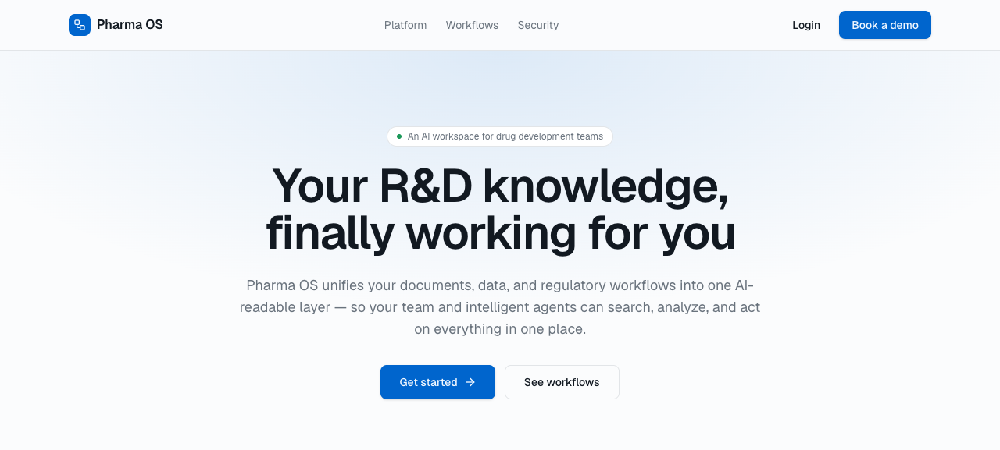
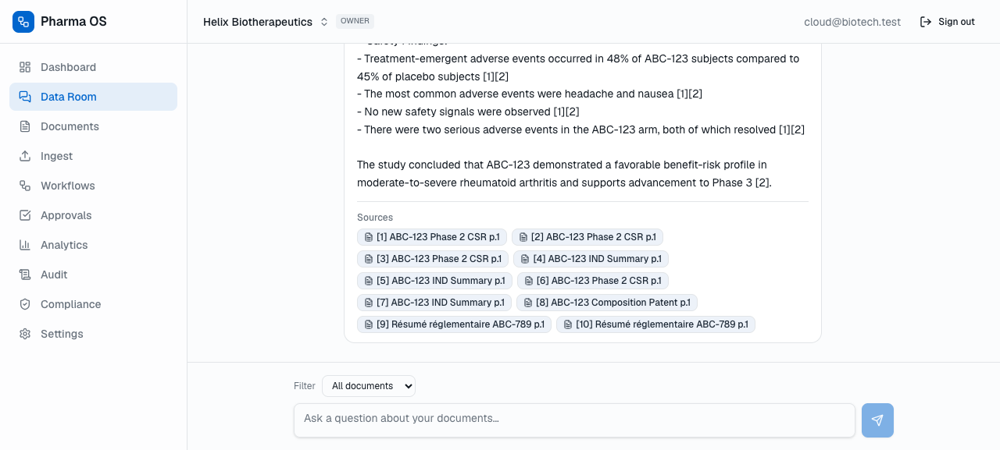
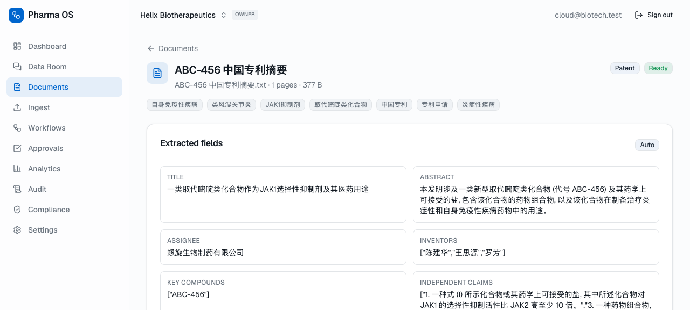

# pharma-os

A reference architecture for **agentic pharma R&D workflows**: multilingual document ingestion, Inngest-orchestrated agents, citation-grounded outputs, and a tamper-evident audit trail.

A public exploration of how the unstructured paper-trail of biopharma R&D (CSRs, INDs, patents, lab notebooks — frequently in mixed languages) could flow into a structured layer that both teams and intelligent agents can act on. Built to clarify my thinking on the CRO/CDMO data-handoff problem, not as a product.

- **Live demo:** https://pharma-os-gilt.vercel.app
- **Demo login:** `cloud@biotech.test` / `clouddemo123` — drops you into an org pre-seeded with documents in **English, Chinese, and French** (CSR, patent, IND, regulatory summary)



**Real RAG answer over the seeded data room — Voyage retrieval + Claude generation, every claim cited and deep-linked to its source page:**



**Multilingual classification + structured extraction — Chinese patent, language auto-detected, fields pulled with per-field verbatim source quotes:**



## What this is

- An **ingestion pipeline** that takes mixed-language documents through parse → chunk → embed → classify → structured field extraction *with per-field source quotes*
- A **data room** with hybrid (vector + keyword) retrieval, cross-encoder reranking, and Claude producing answers that cite the underlying chunks with deep-links to source pages
- An **agent workflow engine** with templated multi-step runs, a bounded tool-use loop, confidence-based escalation, and human-approval pause/resume — all persisted so any run is replayable and inspectable step-by-step
- An **append-only, hash-chained audit log** with an integrity-verification RPC so any AI action is reproducible
- A **multi-tenant Next.js + Supabase app** with RLS on every table, an org-scoped marketing landing page, and a clean app shell

## What this is **not**

- **Not a Coincidence Labs competitor.** The problem space and product inspiration are theirs; this is a reference architecture, public, exploring how I think about the same problems after talking through CRO/CDMO data-handoff
- **Not regulatory-validated** — no GxP qualification, no formal verification of LLM outputs; this is engineering exploration, not a regulated system
- **Not feature-complete:** connectors are CSV/stub interfaces (the contract is wired, live integrations aren't), the dashboard builder is intentionally simple, and the analytics layer is narrow

## Architecture

```
                    ┌──────────────────── Next.js (Vercel) ────────────────────┐
   Browser  <───>   │   RSC pages · Server Actions · Route Handlers · streaming │
                    └─────┬──────────────┬─────────────┬──────────────┬────────┘
                          │              │             │              │
                   (1) Ingest      (2) Doc Proc   (3) Data Room   (4) Agent Engine
                          │              │             │              │
                          └─── Inngest durable functions (retries, fan-out, pause/resume) ───┘
                                                │
                          Supabase Postgres 17 (pgvector + RLS)  ·  Supabase Storage
                                                │
                External APIs:  Claude (via Martian)  ·  Voyage (embed + rerank)  ·  OCR (LlamaParse, optional)
                                                │
              Cross-cutting: append-only, hash-chained audit_log  ·  org-scoped RLS
```

**End-to-end:** upload → `documents` row → Inngest `document.ingested` → parse → (OCR fallback) → chunk → Voyage embed → classify (Haiku) → structured extraction (Opus, function-calling, source-anchored) → routing rules → status `ready`. The same chunks back the data room (cited RAG) and the agent tool layer (`search_data_room`). Every state-changing action writes a hash-chained `audit_log` entry.

Deeper reads:
- [`docs/architecture.md`](docs/architecture.md) — decisions, trust boundaries, Inngest workflow walkthrough
- [`docs/agent-design.md`](docs/agent-design.md) — workflow engine internals, escalation, tool registry
- [`docs/eval.md`](docs/eval.md) — eval plan for multilingual parsing, agent trajectories, citation grounding
- [`db/schema.md`](db/schema.md) — data model, RLS approach, multi-tenancy

## Stack

| Layer | Choice |
|---|---|
| Web | Next.js 16 (App Router, TS, RSC, Server Actions, streaming), Tailwind v4 |
| DB & auth | Supabase (Postgres 17, pgvector HNSW, Storage, Auth, RLS) |
| LLM | Anthropic Claude via the [Martian router](https://withmartian.com) — OpenAI-compatible, provider-swappable in one file |
| Embeddings | Voyage `voyage-3` (1024-dim, multilingual) + `rerank-2` cross-encoder |
| Durable workflows | Inngest (durable steps + retries + pause/resume; inline fallback when unset) |
| Tests & CI | Vitest (unit + integration against a real Supabase), GitHub Actions |

## Quick start (your own instance)

```bash
git clone https://github.com/sarvanithin/pharma-os.git
cd pharma-os
pnpm install

# 1. Supabase (cloud project recommended)
supabase link --project-ref <your-ref>
supabase db push    # applies migrations + seed reference data

# 2. .env.local (see .env.example)
#   Required: NEXT_PUBLIC_SUPABASE_URL, NEXT_PUBLIC_SUPABASE_ANON_KEY, SUPABASE_SERVICE_ROLE_KEY
#   For real AI: MARTIAN_API_KEY (or ANTHROPIC_API_KEY), VOYAGE_API_KEY

# 3. Seed demo docs (English + Chinese + French) through the real pipeline
pnpm exec tsx --env-file=.env.local scripts/seed-demo.ts <your-org-slug>

# 4. Run
pnpm dev
```

The app degrades gracefully without LLM keys — parse + chunk run offline, retrieval falls back to keyword, and agent steps are clearly marked "simulated."

## Roadmap / out of scope

- ✅ ingestion · classification · extraction with source anchors · RAG with citations · agent engine · approvals · analytics · compliance · audit
- 🟨 multilingual — en/fr/zh/it detected via classification and shown in the UI; per-language tsvector configs are still TODO (semantic retrieval already works cross-language via Voyage)
- ❌ live connector integrations (LIMS/QMS/ELN — model is wired, real protocols are stubs)
- ❌ chemistry / cheminformatics (the `drug_hypothesis` workflow uses retrieval + reasoning + always-human escalation, no RDKit)

## Acknowledgments

The problem framing is heavily influenced by **Coincidence Labs** ([coincidencelabs.com](https://www.coincidencelabs.com)), whose product I admire. This repo is independent, not affiliated with them, and not derived from their codebase — it's how I'd explore the same problem space as a public reference.
